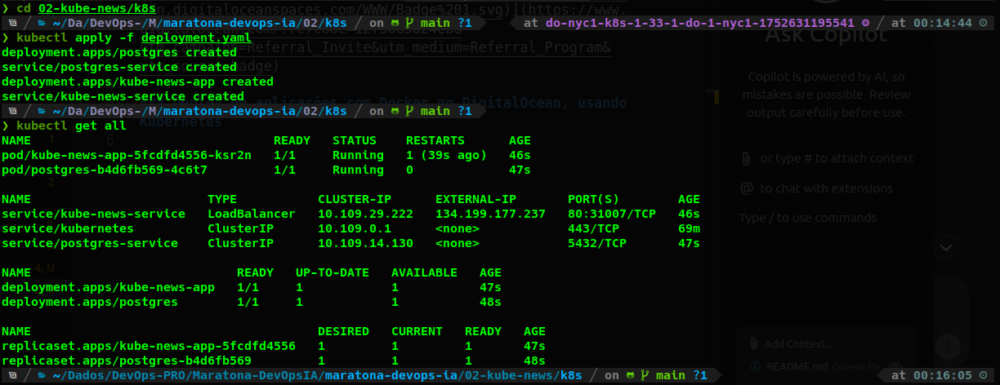
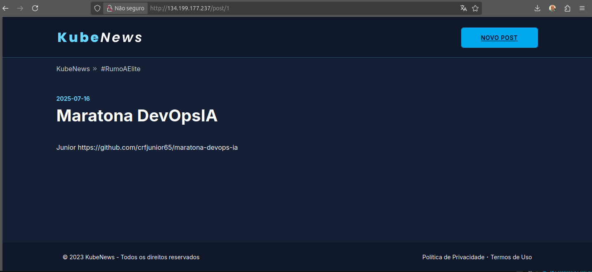
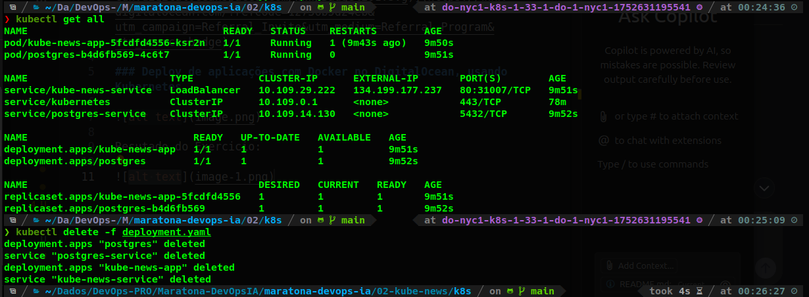
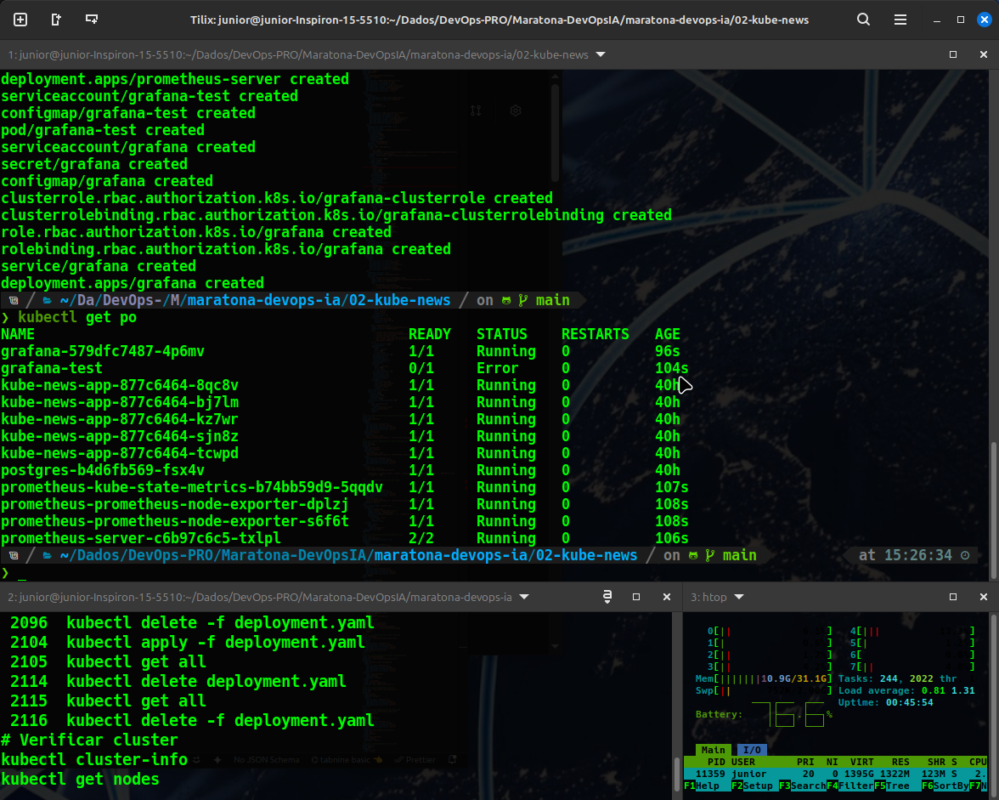
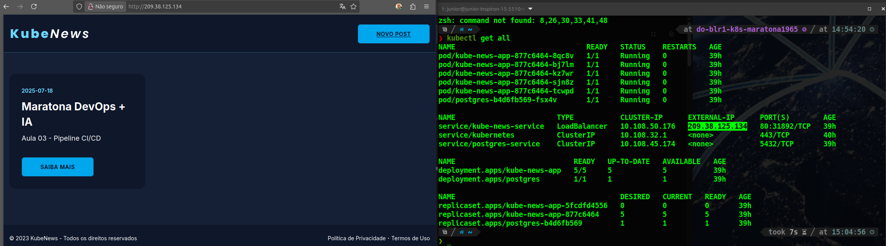

### Maratona no segundo Dia

### Deploy de aplicações com Docker no DigitalOcean, usando Kubernetes

Resutado do Exercicio:

Terminado Exercicio:

### Aula 04 - Deploy de aplicações com Docker no DigitalOcean, usando Kubernetes
Nesse contexto estamos ubindo o manifesto do kubernetes para subir o Prometheus e o Grafana.

### Melhorias no Projeto da Aula 04
Implementar a persistência de dados para o Prometheus e o Grafana, corrigindo o risco de perda de dados.

  A solução envolve duas etapas principais para cada um deles:

   1. Criar um `PersistentVolumeClaim` (PVC): Isso solicita ao Kubernetes um pedaço de armazenamento persistente (que será provido dinamicamente pelo
      seu provedor de nuvem, como a DigitalOcean).
   2. Modificar o `Deployment`: Alterar a definição do Deployment para que, em vez de usar um emptyDir, ele utilize o PVC que criamos.

  Vou focar nas seções relevantes dos manifestos que precisam ser alteradas.

  ---

  1. Corrigindo o Prometheus

  Passo 1.1: Criar o PVC para o Prometheus

  Primeiro, precisamos definir um PersistentVolumeClaim. Este objeto solicita um disco de um determinado tamanho. Adicionaríamos o seguinte manifesto
  ao nosso arquivo prometheus_grafana.yaml:

    1 apiVersion: v1
    2 kind: PersistentVolumeClaim
    3 metadata:
    4   name: prometheus-storage-pvc
    5   labels:
    6     app.kubernetes.io/name: prometheus
    7 spec:
    8   accessModes:
    9     - ReadWriteOnce
   10   resources:
   11     requests:
   12       storage: 10Gi # Solicita um disco de 10GB. Ajuste conforme a necessidade.

   * accessModes: [ReadWriteOnce]: Significa que o volume pode ser montado como leitura e escrita por um único nó. É o padrão para a maioria dos
     volumes de bloco.
   * resources.requests.storage: 10Gi: O tamanho do disco que queremos.

  Passo 1.2: Modificar o Deployment do Prometheus

  Agora, precisamos encontrar o Deployment com name: prometheus-server no arquivo prometheus_grafana.yaml e fazer duas alterações na seção
  spec.template:

   1. Localize a seção volumes.
   2. Altere a definição do volume storage-volume para usar o PVC.

  O que está no arquivo (incorreto):

   1 # ... dentro do Deployment prometheus-server ...
   2       volumes:
   3         - name: config-volume
   4           configMap:
   5             name: prometheus-server
   6         - name: storage-volume
   7           emptyDir: {} # <--- PROBLEMA: Dados temporários

  O que precisamos (corrigido):

   1 # ... dentro do Deployment prometheus-server ...
   2       volumes:
   3         - name: config-volume
   4           configMap:
   5             name: prometheus-server
   6         - name: storage-volume
   7           persistentVolumeClaim:
   8             claimName: prometheus-storage-pvc # <--- CORREÇÃO: Usa o PVC

  Com essa alteração, o pod do Prometheus montará o disco persistente no diretório /data, e as métricas coletadas sobreviverão a reinicializações.

  ---

  2. Corrigindo o Grafana

  O processo para o Grafana é quase idêntico.

  Passo 2.1: Criar o PVC para o Grafana

  Adicionamos outro PVC ao nosso arquivo prometheus_grafana.yaml:

    1 apiVersion: v1
    2 kind: PersistentVolumeClaim
    3 metadata:
    4   name: grafana-storage-pvc
    5   labels:
    6     app.kubernetes.io/name: grafana
    7 spec:
    8   accessModes:
    9     - ReadWriteOnce
   10   resources:
   11     requests:
   12       storage: 5Gi # 5GB é geralmente suficiente para dashboards e configurações.

  Passo 2.2: Modificar o Deployment do Grafana

  Encontramos o Deployment com name: grafana e alteramos a definição do volume storage.

  O que está no arquivo (incorreto):

   1 # ... dentro do Deployment grafana ...
   2       volumes:
   3         - name: config
   4           configMap:
   5             name: grafana
   6         - name: storage
   7           emptyDir: {} # <--- PROBLEMA: Dados temporários

  O que precisamos (corrigido):

   1 # ... dentro do Deployment grafana ...
   2       volumes:
   3         - name: config
   4           configMap:
   5             name: grafana
   6         - name: storage
   7           persistentVolumeClaim:
   8             claimName: grafana-storage-pvc # <--- CORREÇÃO: Usa o PVC

  Isso fará com que o pod do Grafana monte o disco persistente no diretório /var/lib/grafana, garantindo que seus dashboards, fontes de dados e
  outras configurações sejam salvos permanentemente.

